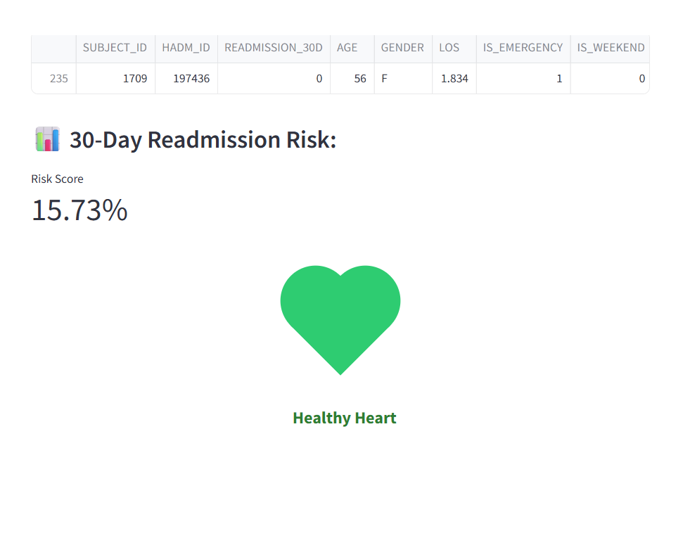

# 🫀 Heart Failure Readmission Prediction System

This project aims to predict **30-day hospital readmission** for heart failure patients using the **MIMIC-III dataset**. It includes a **machine learning pipeline** for training and evaluating models and a **Streamlit-based web application** for patient-level predictions.

---
## 📁 Project Structure

├── heart_failure_model.py # Full ML Pipeline

├── ui.py # Streamlit frontend

├── outputs/ # Model output directory

│ ├── best_model.pkl # Trained model file

│ ├── feature_names.pkl # Model input features

│ ├── final_dataset.csv # Processed dataset
│ └── *.png / *.csv # Visualizations and stats

├── 1.css # Custom CSS for Streamlit UI

├── tests/ # Unit tests (optional)

└── data/

└── mimic/ # Raw training data (MIMIC-III CSVs)
## 🔧 Features

### ✅ Backend (`fail_prediction.py`)
- **Loads** MIMIC-III clinical tables (`ADMISSIONS`, `PATIENTS`, `DIAGNOSES_ICD`, etc.)
- **Identifies** heart failure cases based on ICD-9 codes.
- **Creates** 30-day readmission labels from admission history.
- **Extracts**:
  - Demographics (Age, Gender)
  - Admission features (LOS, Emergency flag)
  - Comorbidities (Diabetes, Stroke, etc.)
  - Medication usage (e.g., ACE inhibitors, Beta-blockers)
  - Lab values (Creatinine, BNP, etc.)
- **Performs** EDA with visual plots.
- **Trains** 4 models:
  - Logistic Regression
  - Random Forest
  - Gradient Boosting
  - XGBoost
- **Selects** the best model using ROC-AUC and PR-AUC.
- **Saves** the final model and feature names using Pickle.
### ✅ Frontend (`ui.py`)
- Built using **Streamlit**
- Accepts a **Patient ID** as input
- Fetches latest admission data for that patient
- Predicts risk of readmission using saved model
- Displays:
  - Probability score
  - Health status (green/amber/red heart icons)
  - Patient features (as a table)

## 🖼️ Sample Outputs (from `outputs/` folder)
- 📊 `01_readmission_distribution.png`: Readmission class distribution
- 📈 `08_roc_curves.png`: ROC curves of all models
- 📉 `09_precision_recall_curves.png`: PR curves
- 📊 `10_confusion_matrix.png`: Final model performance
- 📋 `07_summary_statistics.csv`: Mean, std, missing values

## 🚀 How to Run

### 1. Train Model
Make sure all relevant MIMIC CSV files are in a folder (e.g., `/data/mimic-iii/`). Then run:
```bash  python heart_failure_model.py

This generates:
->final_dataset.csv
->best_model.pkl
->feature_names.pkl
   
2.Launch Streamlit App

>>>streamlit run ui.py
Then enter a Patient ID to get predictions.

3. Requirements
Install dependencies with:
>>>pip install pandas numpy matplotlib seaborn scikit-learn xgboost streamlit


## 📸 Screenshots

### Main Page
 .png)


### ✅ Case 1: Healthy Heart (Low Risk)
Prediction score is below 30%. The UI shows a green heart icon with the label **"Healthy Heart"**.





---

### ⚠️ Case 2: Heart At Risk (Moderate Risk)
Prediction score is between 30% and 60%. The UI displays an amber/orange heart with the label **"Heart At Risk"**.


### 🚨 Case 3: Critical Heart (High Risk)
Prediction score is above 60%. The app highlights this with a red heart icon and the label **"Critical Heart"**.


